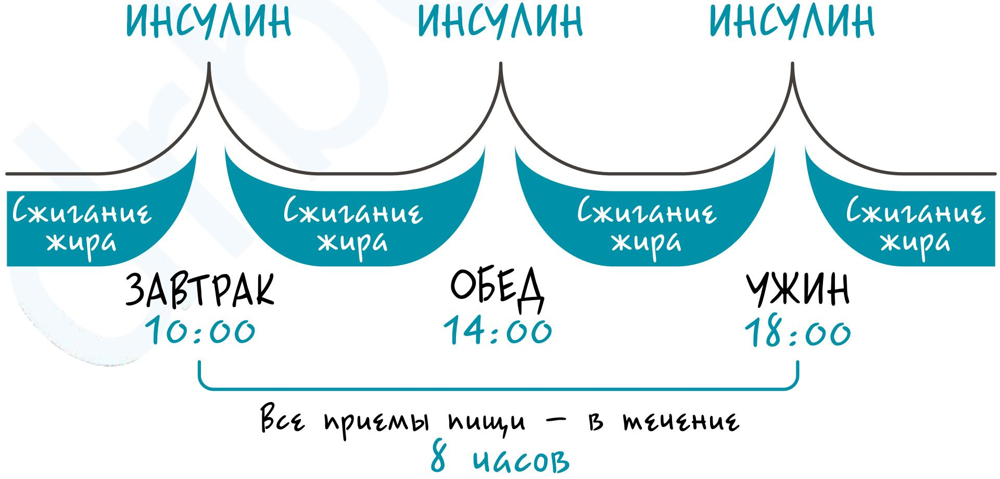
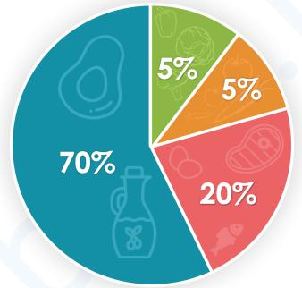

## Кето диета

### Интервальное голодание ⏳
Важен режим питания, так как при каждом приеме пищи выбрасывается инсулин. На интервальном голодании вы чередуете еду и ее отсутствие. Начать можно с трех приемов пищи, отказаться от перекусов. Когда вы адаптируетесь и ваш организм перестанет испытывать голод, можно перейти на двухразовое питание. Интервал голодания (с ужина до следующего завтрака) должен составлять не менее 16 часов.

### Соотношение углеводов, белков, жиров
- 5% углеводов из ягод, хумуса, сладких овощей + 5% из некрахмалистых овощей (салаты из капусты, зелени, огурцов)
- 20% белков
- 70% полезных жиров

### Продукты (количество в месяц)

#### ОВОЩИ И ЗЕЛЕНЬ
- капуста белокочанная + пекинская  - 2кг
- болгарские перцы - 2кг
- кабачки, цукини - 2кг
- помидоры (черри или обычные) - 1.7кг
- лук репчатый - 1.6кг,  лук зеленый - 4 пучка
- морковь - 1кг
- капуста цветная - 0.7кг
- зелень (шпинат, руккола, листья салата, петрушка, укроп, кинза, базилик) - 1кг
- огурцы - 1кг, соленые - 2 шт.
- фасоль стручковая - 0.7кг
- брокколи - 0.3кг
- авокадо - 5 шт.
- редис - 10 шт.
- сельдерей - 9 стеблей
- чеснок - 3 головки

#### МЯСО
- говядина, телятина, свинина - 5.5кг
- курица - 4кг
- бекон, ветчина - 0.5кг
- куриная печень - 0.5кг
- яйца - 50 шт.

#### РЫБА
- рыба (лосось, семга, толстолобик, семга, зубатка) - 2.5кг
- тунец консервированный - 2 банки
- креветки - 0.4кг 

#### МОЛОЧНЫЕ ПРОДУКТЫ
- сыр - 2кг
- масло - 0.5кг
- сливки (>30%) - 0.7кг
- сметана (>20%) - 0.6кг
- творог жирный - 0.2кг

#### ДРУГОЕ
- 🫒 оливки, оливковое масло - 1кг
- шампиньоны - 0.7кг
- домашний майонез - 0.5кг
- орехи (пекан, кешью, грецкие, арахис, миндаль, мускатный орех, семена тыквы) - 500г
- шампиньоны 400г
- ягоды (клубника, малина, ежевика, черника) 200г
- кокос, кокосовое масло 300г
- горчица 200г
- соль морская
- кунжут, куркума, какао-порошок
- яблочный уксус (нефильтрованный)
- лимон 7 шт.
- кофе, чай

#### ПОЛЕЗНОE
- :heart: [Напиток от простуды](https://youtu.be/Z16EMXN_vPI)
- 🍞=:shit: [Что будет, если вы откажетесь от хлеба?](https://youtu.be/Z16EMXN_vPI)
